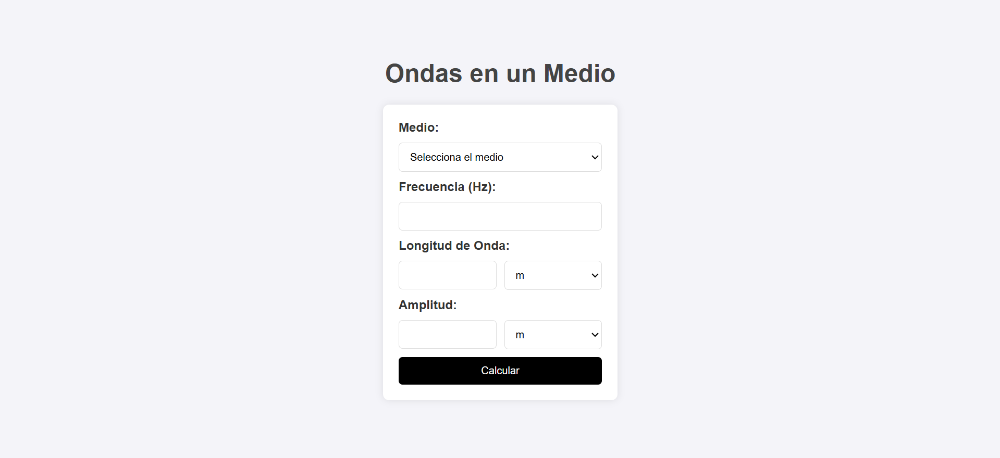
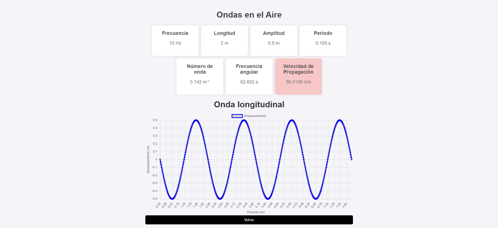

# Simulador de Ondas 🌊

Este proyecto es una aplicación interactiva que permite **calcular y visualizar ondas mecánicas** en diferentes medios (aire, agua, etc.).

## 🚀 Funcionalidades
- Ingreso de parámetros: frecuencia, longitud de onda y amplitud.
- Cálculo de propiedades: periodo, número de onda, frecuencia angular y velocidad de propagación.
- Visualización gráfica de la onda (longitudinal).

## 🛠️ Tecnologías usadas
- HTML, CSS, JavaScript (o React si aplica)
- Librerías de gráficos: Plotly / Chart.js (según la que uses)

## 📷 Ejemplo de uso



## 📚 Fórmulas utilizadas
- Periodo: `T = 1 / f`
- Velocidad de propagación: `v = λ * f`
- Número de onda: `k = 2π / λ`
- Frecuencia angular: `ω = 2π * f`

## 📦 Instalación
```bash
git clone https://github.com/Juanh10/simulador-ondas.git
cd simulador-ondas
```
---

👨‍💻 Autor

Juan David Hernández

📍 Espinal, Tolima – Colombia

💼 Estudiante de Ingeniería de Sistemas | Programador Junior

---

📝 Licencia

Este proyecto está bajo la licencia MIT.
